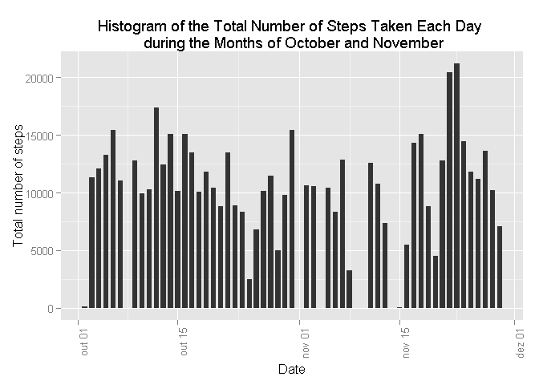
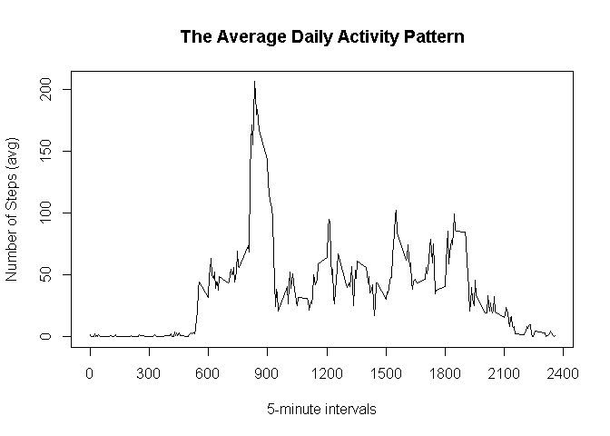
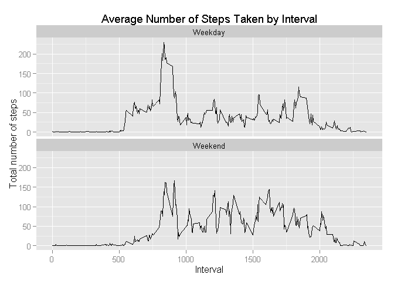

# Reproducible Research: Peer Assessment 1


## Loading and preprocessing the data
* Load the data

```r
df <- read.table(unz("activity.zip", "activity.csv"), header=T, sep=",", colClasses = c("numeric", "character", "numeric"), na.strings = "NA")
```

*Process/transform the data into a format suitable for your analysis

```r
library(dplyr)
```

```
## 
## Attaching package: 'dplyr'
## 
## The following objects are masked from 'package:stats':
## 
##     filter, lag
## 
## The following objects are masked from 'package:base':
## 
##     intersect, setdiff, setequal, union
```

```r
df$DateType <- as.Date(df$date)
df <- df[c("DateType", "steps", "interval")]
colnames(df)[1] <- "date"
```

## What is mean total number of steps taken per day?
For this part of the assignment, I am ignoring the missing values in the dataset.

* Calculate the total number of steps taken per day

```r
df.no_na <- filter(df, !is.na(df$steps))
df.by_day <- group_by(df.no_na, date) 
df.asc <- arrange(df.by_day, date)
df.mean <- summarise(df.asc, Total = sum(steps), Mean = mean(steps))

library(ggplot2)
```

```
## Warning: package 'ggplot2' was built under R version 3.2.2
```

```r
ggplot(df.no_na, aes(date, steps)) + geom_bar(stat = "identity",width = 0.7) + labs(title = "Histogram of the Total Number of Steps Taken Each Day \n during the Months of October and November", x = "Date", y = "Total number of steps") + theme(axis.text.x = element_text(angle = 90, hjust = 1)) 
```

 

* Calculate and report the mean and median of the total number of steps taken per day


```r
mean(df.mean$Total)
```

```
## [1] 10766.19
```


```r
median(df.mean$Total)
```

```
## [1] 10765
```

## What is the average daily activity pattern?
* Make a time series plot (i.e. type = "l") of the 5-minute interval (x-axis) and the average number of steps taken, averaged across all days (y-axis)


```r
df.by_interval <- group_by(df.no_na, interval) 
df.i_asc <- arrange(df.by_interval, interval)
df.i_mean <- summarise(df.i_asc, Total = sum(steps), Mean = mean(steps))

plot(df.i_mean$interval, df.i_mean$Mean, type = "l", axes=F, main = "The Average Daily Activity Pattern", xlab = "5-minute intervals", ylab = "Number of Steps (avg)")
axis(side=2, at=seq(0, 200, by=50))
axis(side=1, at=seq(0, 2400, by=300))
box()
```

 

* Which 5-minute interval, on average across all the days in the dataset, contains the maximum number of steps?

```r
df.i_mean[which.max(df.i_mean$Mean), c(1,3)]
```

```
## Source: local data frame [1 x 2]
## 
##   interval     Mean
## 1      835 206.1698
```

## Imputing missing values
* Calculate and report the total number of missing values in the dataset (i.e. the total number of rows with NAs)


```r
count(df[is.na(df$steps),])
```

```
## Source: local data frame [1 x 1]
## 
##      n
## 1 2304
```
 
* Devise a strategy for filling in all of the missing values in the dataset. The strategy does not need to be sophisticated. For example, you could use the mean/median for that day, or the mean for that 5-minute interval, etc. 

* Create a new dataset that is equal to the original dataset but with the missing data filled in.

In this case I am using mean of the interval to fill the missing values. I' using a previously calculated dataset that has the mean grouped by interval.


```r
df.filled <- df
for (i in 1:nrow(df)) {
        if(is.na(df.filled[i,"steps"])){
                df.filled[i, "steps"] <- floor(df.i_mean[which(df.filled[i, "interval"] == df.i_mean$interval), ]$Mean)
        }
  
}
```

* Make a histogram of the total number of steps taken each day 


```r
df.filled.by_day <- group_by(df.filled, date) 
df.filled.asc <- arrange(df.filled.by_day, date)
df.filled.mean <- summarise(df.filled.asc, Total = sum(steps), Mean = mean(steps))

ggplot(df.no_na, aes(date, steps)) + geom_bar(stat = "identity",width = 0.7) + labs(title = "Histogram of the Total Number of Steps Taken Each Day \n during the Months of October and November Using the Mean value to Fill NAs", x = "Date", y = "Total number of steps") + theme(axis.text.x = element_text(angle = 90, hjust = 1)) 
```

 


* Calculate and report the mean and median total number of steps taken per day. Do these values differ from the estimates from the first part of the assignment? What is the impact of imputing missing data on the estimates of the total daily number of steps?


```r
# Mean without NA values
m1 <- as.numeric(mean(df.mean$Total))
# Mean using the replacement of NA values
m2 <- as.numeric(mean(df.filled.mean$Total))

#difference
d1 <- abs(m1-m2)

# Median without NA values
md1 <- as.numeric(median(df.mean$Total))
# Median using the replacement of NA values
md2 <- as.numeric(median(df.filled.mean$Total))

#difference
d2 <- abs(md1-md2)

# Visualizing the differences

dif <- matrix(c(m1, md1, m2, md2, d1 , d2),ncol=2, nrow = 3, byrow = TRUE)
colnames(dif) <- c("Mean","Median")
rownames(dif) <- c("NA Removed","NA Replaced", "Difference")
dif
```

```
##                    Mean Median
## NA Removed  10766.18868  10765
## NA Replaced 10749.77049  10641
## Difference     16.41819    124
```

In the table above we can see that the difference between "NA Removed" and "NA Replaced" is not very large. The Mean had a slight difference of 16.5 steps and the Median 124 steps.

## Are there differences in activity patterns between weekdays and weekends?

* Create a new factor variable in the dataset with two levels – “weekday” and “weekend” indicating whether a given date is a weekday or weekend day.


```r
Sys.setlocale(category = "LC_ALL", locale = "English_United States.1252")
```

```
## [1] "LC_COLLATE=English_United States.1252;LC_CTYPE=English_United States.1252;LC_MONETARY=English_United States.1252;LC_NUMERIC=C;LC_TIME=English_United States.1252"
```

```r
df.filled$WeekDay <- weekdays(df.filled$date)

match <- as.character(grepl('^S', df.filled[,"WeekDay"]))

match[match=="TRUE"] <- "Weekend"
match[match=="FALSE"] <- "Weekday"

df.filled <- cbind(df.filled, match)

colnames(df.filled) <- c("Date", "Steps", "Interval", "WeekDay", "WeekType")
```

* Make a panel plot containing a time series plot (i.e. type = "l") of the 5-minute interval (x-axis) and the average number of steps taken, averaged across all weekday days or weekend days (y-axis). See the README file in the GitHub repository to see an example of what this plot should look like using simulated data.


```r
df.filled.by <- group_by(df.filled, Interval, WeekType)
df.filled.by <- summarise(df.filled.by, Mean = mean(Steps))

ggplot(data = df.filled.by, mapping = aes(x = Interval, y = Mean)) + geom_line()  + facet_wrap(~ WeekType, ncol=1) + ggtitle("Average Number of Steps Taken by Interval") + labs(title = "Average Number of Steps Taken by Interval", x = "Interval", y = "Total number of steps")
```

 
